# Registro de modelos

Cómo fueron cambiando los modelos del Aviario 3D, del estilo PS1 (primitivas armadas en código) al estilo
N64 (piezas modeladas en Blender por script). Las decisiones de diseño vienen de la revisión con el usuario
en cada iteración; el método está en [`blender/NOTAS.md`](../blender/NOTAS.md) y la lista de piezas en
[`blender/KIT.md`](../blender/KIT.md).

## Poroto (el explorador)

### 0 · Original: primitivas PS1 (antes de 2026-09-30)

Armado en `js/poroto.js` con esferas, cilindros y cajas; gorro de lana, pluma-brújula, ojos grandes,
binoculares. Medía ~2,2 unidades en un mundo sin escala real.

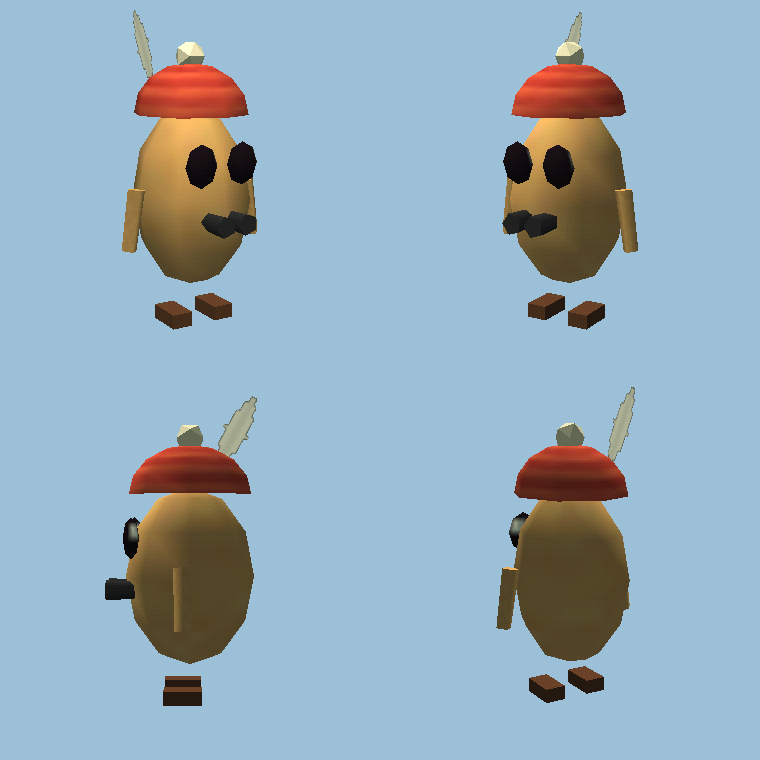

### 1 · Primer modelo en Blender: forma de poroto (2026-09-30)

Se llevó el diseño original a Blender (1,04 m): cuerpo de poroto, gorro de lana con pompón, correa,
texturas chicas con filtro bilineal. **2.526 triángulos.**

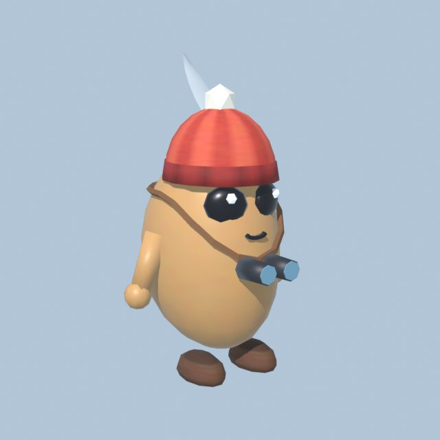

### 2 · Explorador ovalado (tipo minion)

Pedido: ojos más chicos, brazos coherentes, frente visible, bigote chistoso, forma ovalada, mochila,
casco de explorador y versión con lentes de sol. Cuerpo cápsula, salacot, bigote de manubrio, guantes,
mochila con saco de dormir, short y botas. **~6.400 triángulos.**

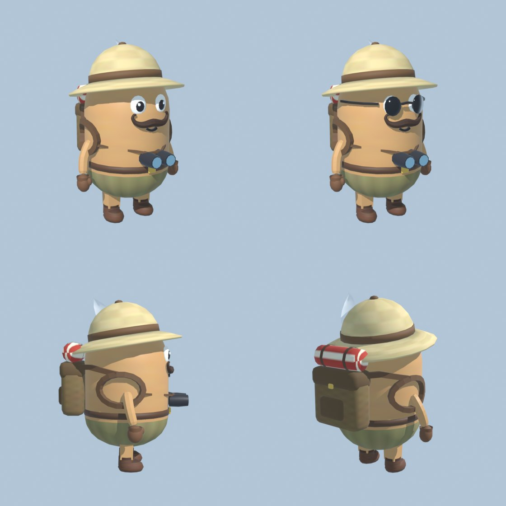

### 3 · Ojos punto, flor en el casco, detalles pintados

Ojos como puntos negros, sin boca ni pluma, flor rosa de centro amarillo en el casco, binoculares colgando
en vertical, cinturón pintado en la textura (no como anillo), tirantes más simples, 15 % más delgado.
**3.454 triángulos.**

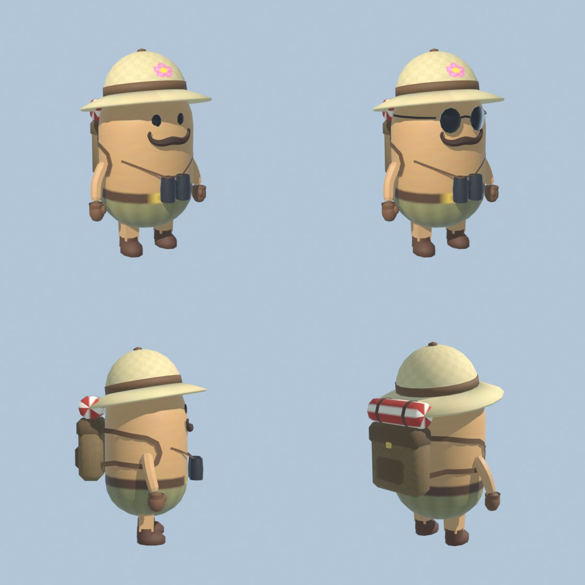

### 4 · Cachetes y extremidades "cozy"

El usuario agregó dos esferas de cachetes en Blender; se fusionaron con el cuerpo. Bigote, tirantes y
correa pasan a tiras pegadas a la piel con perfil ">" (la correa de los binoculares rodea todo el cuerpo);
brazos y piernas redondeados; sin caras escondidas. **1.764 triángulos.**

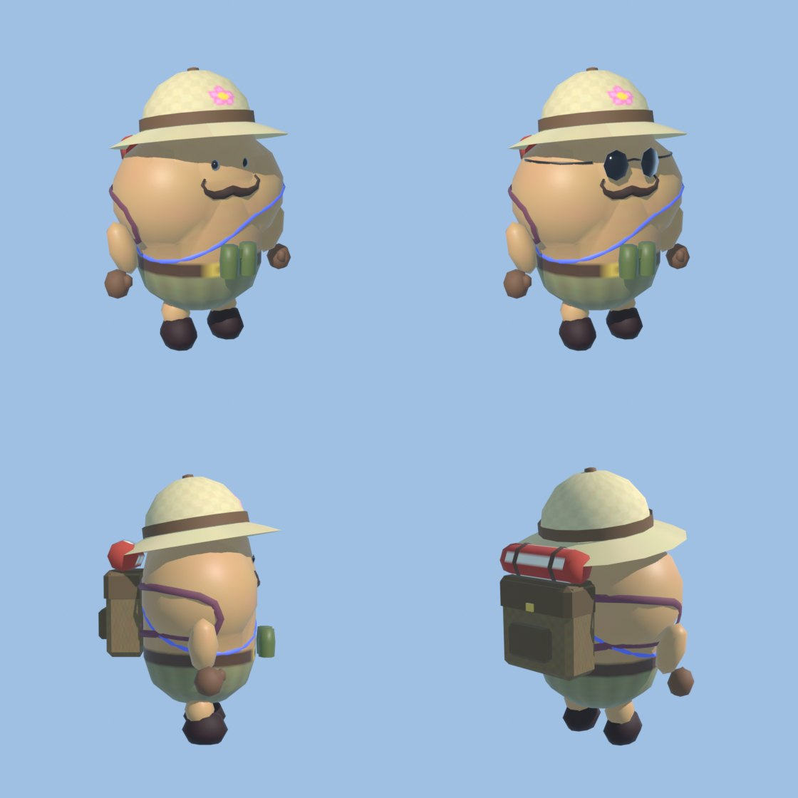
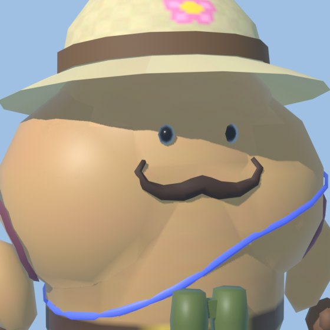

### 5 · Volúmenes fundidos, brazos musculosos y sandalias

El rostro se veía arrugado donde se juntaban las esferas: el cuerpo pasa a ser una sola superficie
fundida (cápsula + cachetes + bola frontal del rostro + hombros anchos). Brazos tipo Popeye con guante de
puño acampanado; sandalias con pantorrilla ancha que se afina al tobillo. **2.232 triángulos.**
Esta versión quedó archivada (`blender/poroto_v5_build.py`, `models/poroto_v5.glb`).

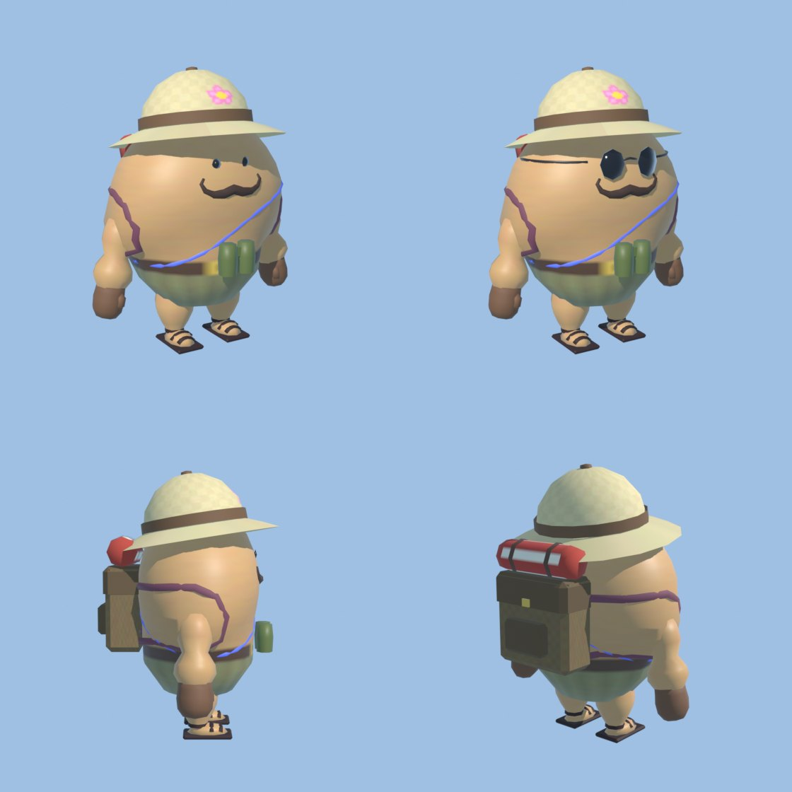
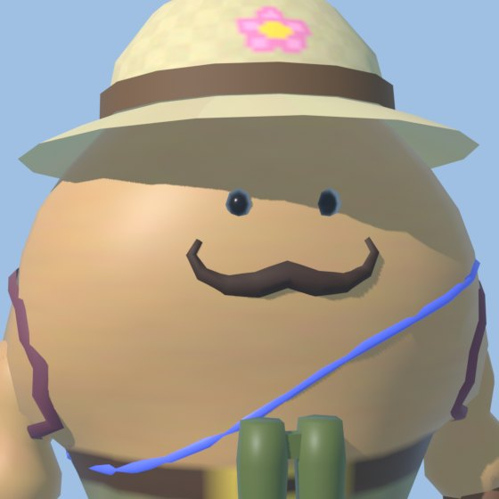

### 6 · Poroto N64, construido como Darunia (versión vigente)

Con la referencia de Darunia (OoT, 414 triángulos; modelo ripeado, solo uso local) se rehízo con la
lógica de los personajes de N64: secciones octogonales, cara plana con ojos **pintados** (se parpadea
cambiando la textura), y todo lo plano (cinturón, tirantes, correa, flor, sandalias) pintado en texturas
de 5 bits; sombra horneada en colores por vértice. **562 triángulos.** Integrado al juego
(`blender/poroto_n64_build.py` → `models/poroto.glb`).

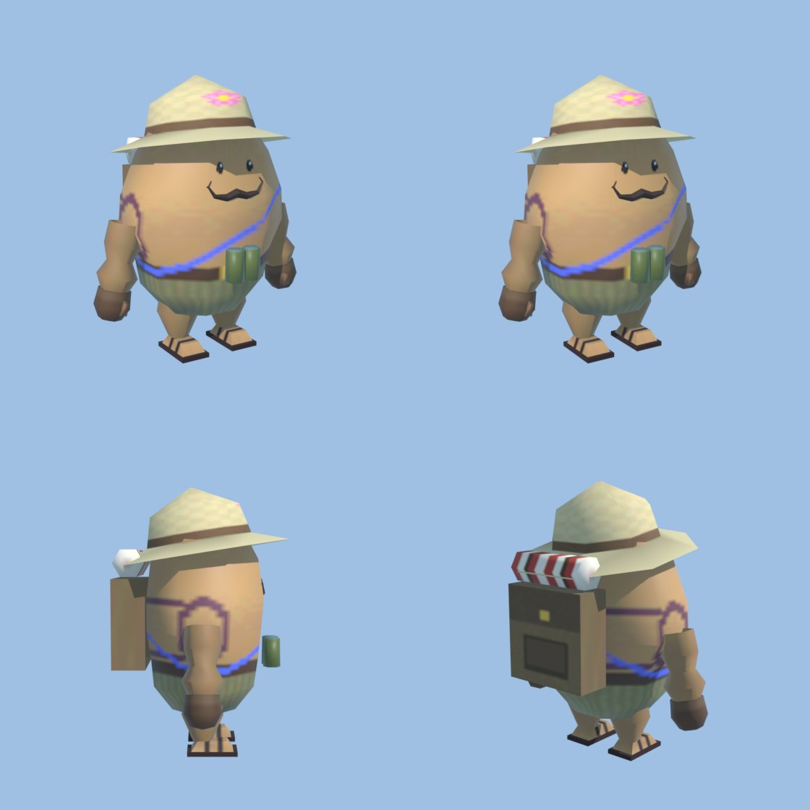
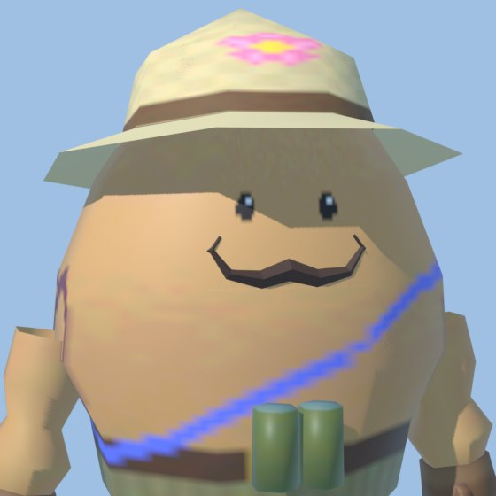

En el juego (binoculares, parpadeo, libreta, mapa, bufanda de invierno, dormido):

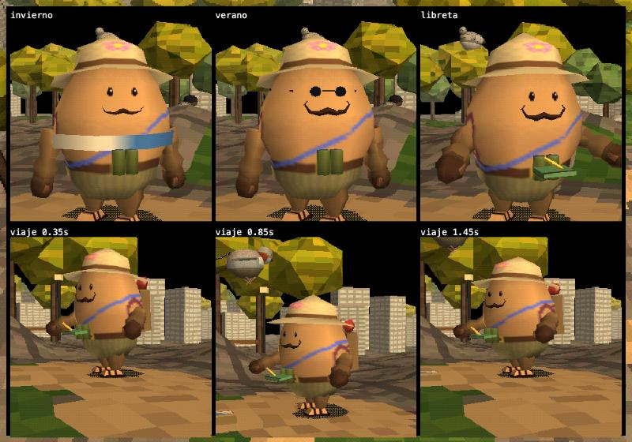

| versión | triángulos | qué cambió |
|---|---:|---|
| 0 · original PS1 | — | primitivas en código |
| 1 · poroto | 2.526 | primer modelo en Blender |
| 2 · explorador | ~6.400 | forma ovalada, salacot, bigote, mochila, lentes |
| 3 · ojos punto | 3.454 | detalles pintados, menos piezas |
| 4 · cachetes | 1.764 | tiras pegadas a la piel, sin caras escondidas |
| 5 · suave | 2.232 | volúmenes fundidos, brazos musculosos, sandalias |
| **6 · N64** | **562** | construcción tipo Darunia, todo plano pintado |

## Kit del mundo

Primeras piezas (`blender/kit_build.py` → `models/kit/`): roca (3 formas, ~21 triángulos c/u), árbol de
copa (132), espino con copa plana de acacia (129), arbusto (68) y pasto (6). Texturas grises de 32×32 que
el juego tiñe por especie; copas con tarjetas de borde transparente, como los árboles de Harry Potter y
Re-Volt que se usaron de referencia. Con ellas se arman 14 especies de plantas y las rocas.

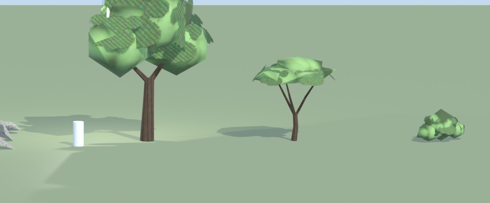

## Aves: antes y después

Las aves se arman en `js/bird.js` por plan de cuerpo, con las proporciones de AVONET y la paleta aprobada
de cada especie. **Antes:** cuerpo, cabeza, ala y cola eran esferas y una caja. **Después:** piezas
modeladas en Blender (`blender/aves_build.py` → `models/kit/ave_partes.glb`): cuerpo en gota, cabeza con
frente, ala plana con las primarias en punta y cola en abanico, en el mismo espacio que las primitivas
(se conservan pivotes, animaciones y pintura por especie). Patas con pie plano de 4 triángulos.
~220 triángulos por ave (antes 188). Paloma, gaviota, pingüino y flamenco tienen piezas propias (abajo); los demás planes usan las del
ave base hasta tener las suyas.

### Planes propios: paloma y gaviota

Con las referencias de Half-Life 2 (paloma de 540 triángulos y gaviota de 470) se hicieron juegos de
piezas propios. **Paloma** (tórtolas, torcazas, paloma doméstica): pecho profundo y alto, cabeza chica,
ala plegada ancha de punta redondeada, cola ancha y cuadrada, cuerpo más erguido. **Gaviota** (gaviotas,
petreles, albatros, salteadores): cuerpo de torpedo, frente plana, ala larga y angosta que pasa la cola,
cola corta. Mismo presupuesto que el ave base (~210 triángulos por ave).

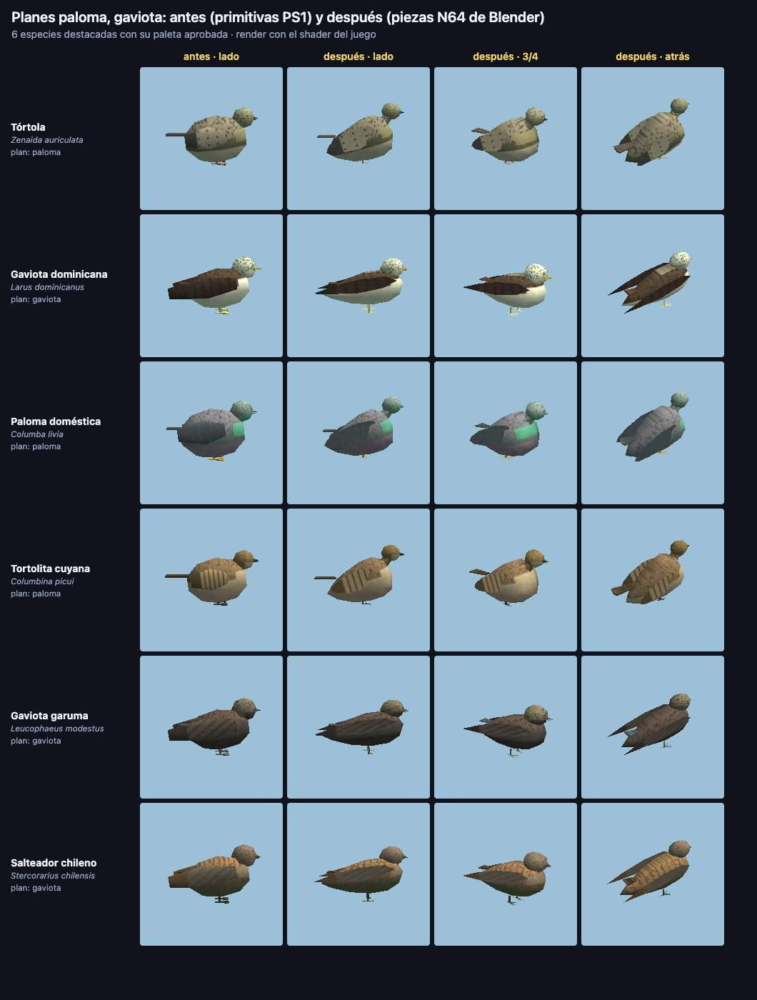

### Planes propios: pingüino y flamenco (y cuello en S)

Con las referencias de Zoo Tycoon 2 (pingüino emperador de 1.154 triángulos y flamenco de 1.027).
**Pingüino:** cuerpo de huso erguido, más ancho abajo; cabeza que se funde con el cuerpo; aletas planas y
angostas; cola mínima bajo el cuerpo. **Flamenco:** cuerpo chico y ovalado, ala plegada en punta. Además,
el cuello de flamenco, cisne y garza pasa de un cilindro recto a un **tubo curvo en S**.

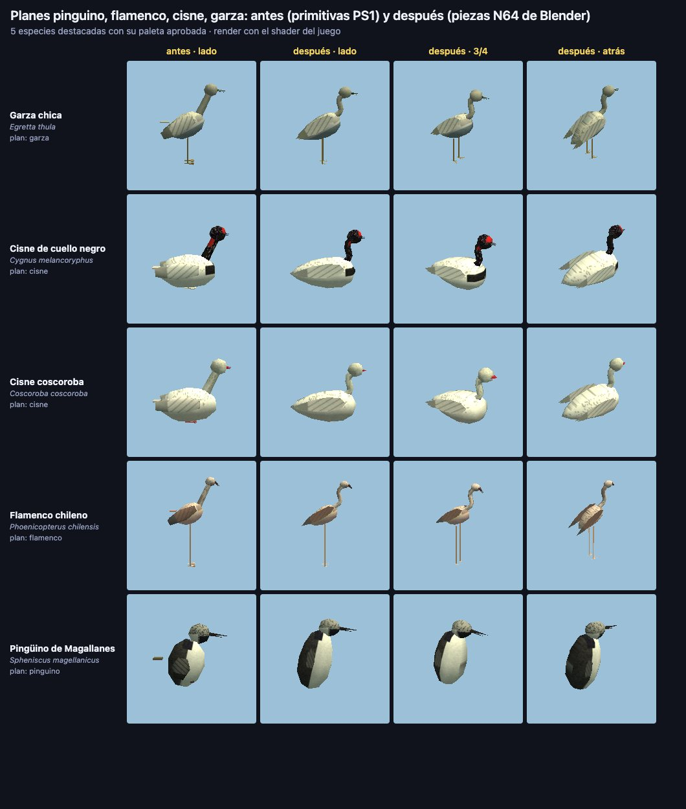

### Metropolitana

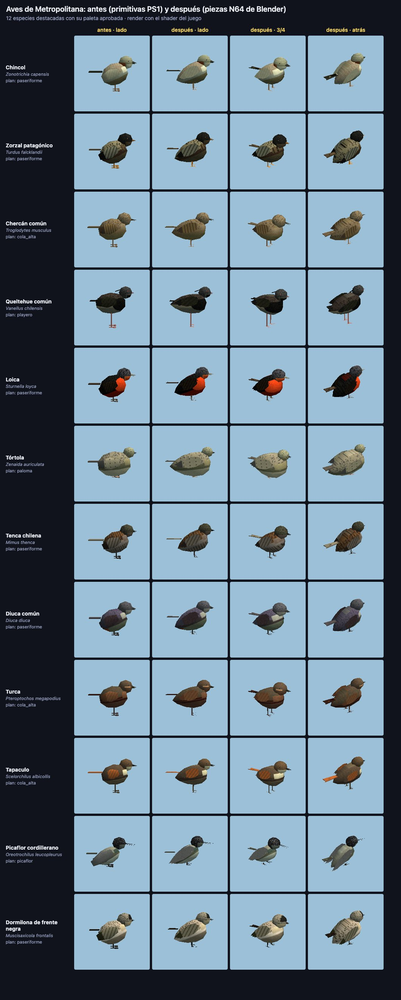

### Valparaíso

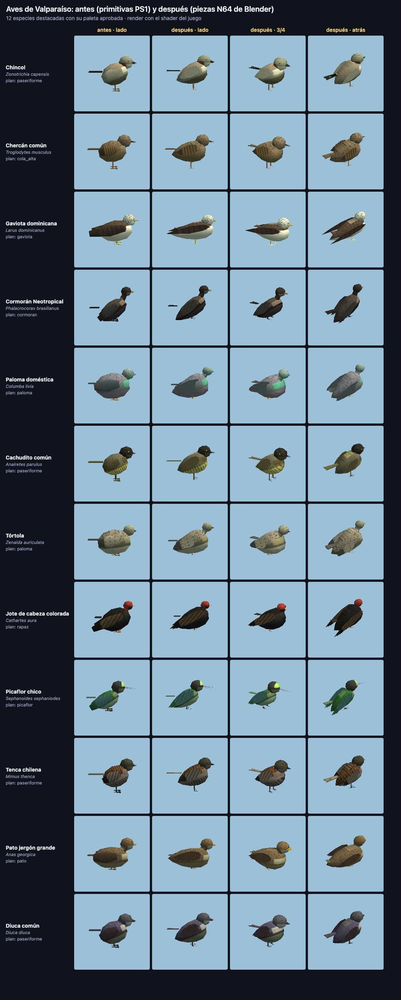

### Magallanes

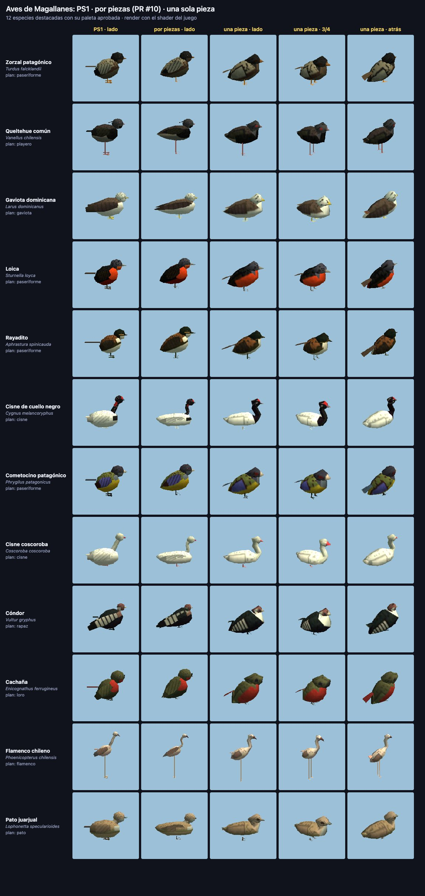

## Cómo regenerar las imágenes

Las hojas de aves y del Poroto original se dibujan con el código del juego en `docs/registro/` y se
capturan con Chrome headless (con el servidor de desarrollo corriendo en el puerto 8765):

```bash
CH="/Applications/Google Chrome.app/Contents/MacOS/Google Chrome"
for R in CL-RM CL-VS CL-MA; do "$CH" --headless=new --use-angle=swiftshader --enable-unsafe-swiftshader --hide-scrollbars --window-size=1060,2640 --virtual-time-budget=25000 --screenshot="/tmp/aves_$R.png" "http://localhost:8765/docs/registro/aves.html?region=$R" && sips -s format jpeg -s formatOptions 86 "/tmp/aves_$R.png" --out "docs/registro/img/aves_$R.jpg"; done
```

El "antes" usa copias archivadas del código anterior (`docs/registro/antes/`). Las hojas de Poroto en
Blender salen de `blender/render_hoja.py`.
